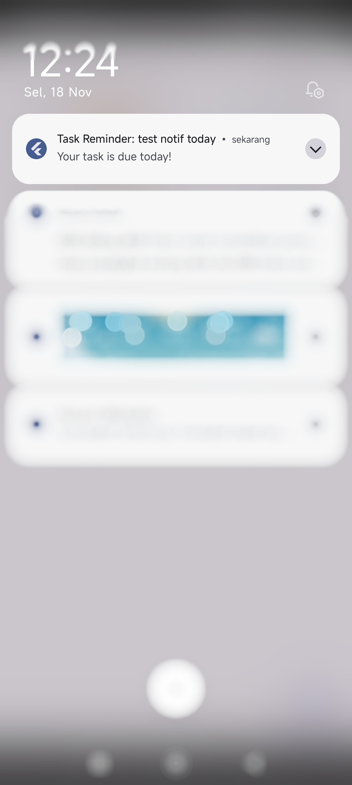

# 📝 Flutter To-Do List App

A simple yet feature-rich To-Do List application built with Flutter and Provider for state management.

## ✨ Features

- ✅ Add, edit, and delete tasks
- 🏷️ Assign priorities (Low, Medium, High) with automatic sorting
- 📅 Set due dates with countdown and overdue notifications
- 📝 Add detailed notes to each task
- 🔍 Real-time search across task titles and notes
- 🔔 Local notifications for task reminders
- 📂 Organize tasks with custom categories
- 🎨 Drag-and-drop to reorder tasks
- 💾 Persistent data storage using SharedPreferences

## 📸 Screenshots and GIF
1. Local Notification


2. Demo App


3. Demo App (Search)


## Download
You can download the latest APK from the [Releases Page](https://github.com/indra210595/todo_app/releases).

## 🚀 How to Run

1.  Clone the repository:
    ```bash
    git clone https://github.com/indra210595/todo_app
    ```
2.  Navigate to the project directory:
    ```bash
    cd todo_app
    ```
3.  Install dependencies:
    ```bash
    flutter pub get
    ```
4.  Run the app:
    ```bash
    flutter run
    ```

## 🛠️ Tech Stack

- **Framework:** Flutter
- **State Management:** Provider
- **Local Storage:** SharedPreferences
- **Notifications:** flutter_local_notifications
- **UI:** Material Design 3

---
Made with ❤️ by [Indra Sadikin](https://github.com/indra210595/)